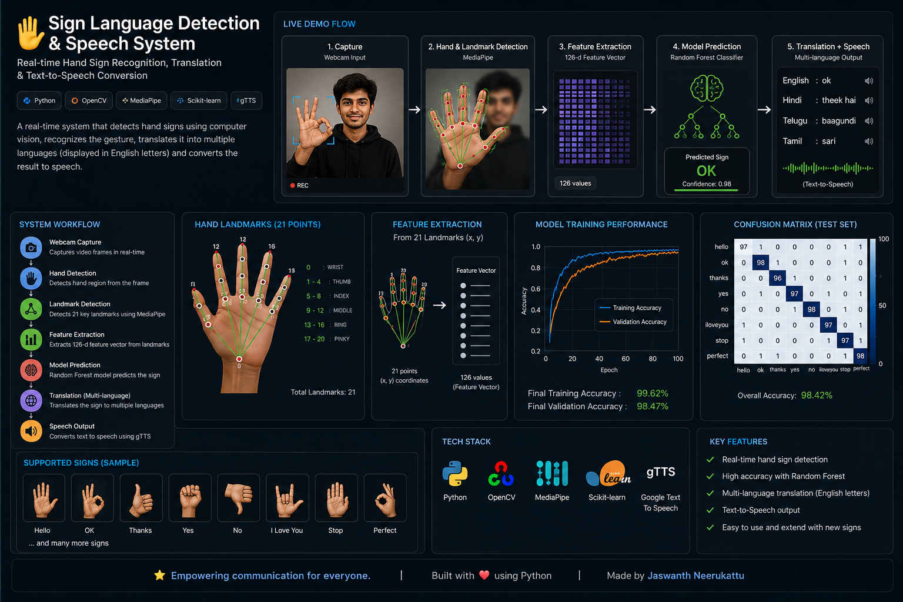
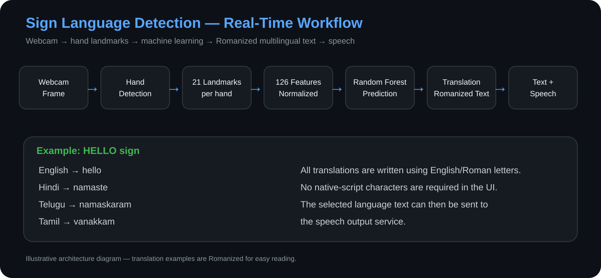
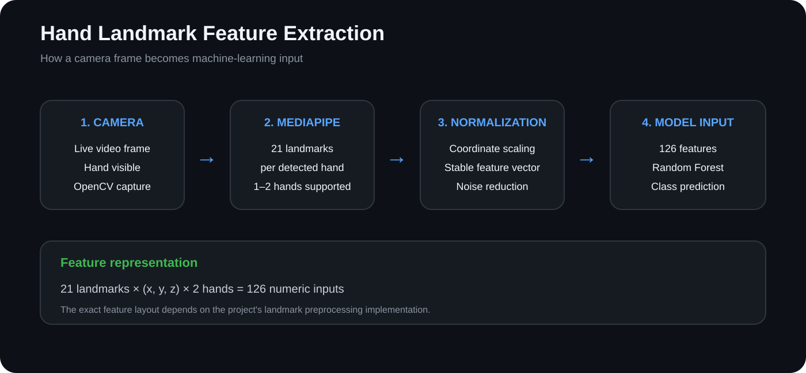
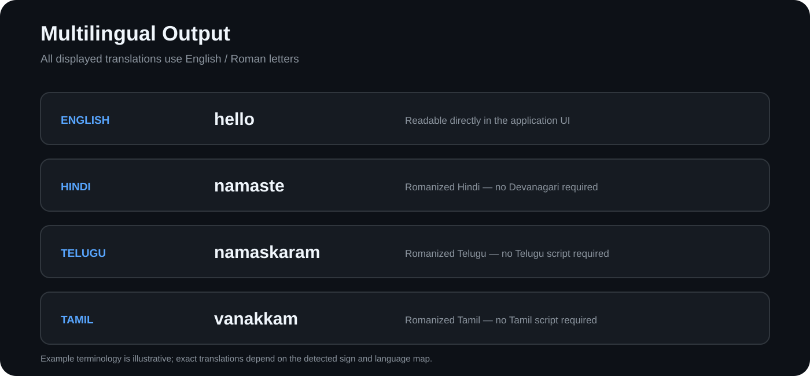
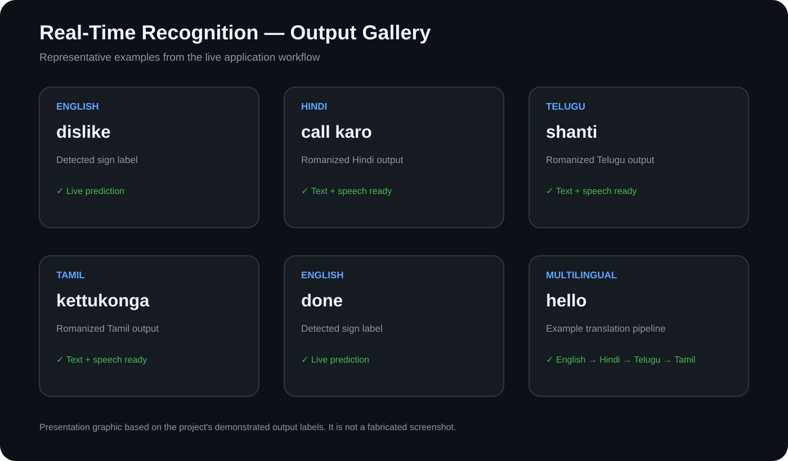

# 🤟 SIGN LANGUAGE RECOGNITION

**Created and developed by Jaswanth Neerukattu.**

A personal machine-learning and computer-vision project for real-time sign language recognition using a webcam, MediaPipe hand landmarks, and a Random Forest classifier, with multilingual text and speech output.

## 📌 Project Showcase



**A professional visual overview of the SIGN LANGUAGE RECOGNITION project architecture, machine-learning pipeline, multilingual output and key capabilities.**

> This showcase is a documentation graphic created to explain the project. It is not presented as a runtime screenshot or as measured model-performance evidence.

## 👨‍💻 Author & Ownership

**Jaswanth Neerukattu**  
GitHub: [Jaswanth-36](https://github.com/Jaswanth-36)

**Created and developed by Jaswanth Neerukattu.** This project is presented as my original work. If you use or reference this project, please credit **Jaswanth Neerukattu** and link back to this repository.

### Authorship & provenance

This repository is the public source repository for my original project. The source code, project organization, documentation, and development history are maintained under my GitHub account, **Jaswanth-36**. Git commits provide a public, timestamped development record.

A public GitHub repository is useful evidence of authorship because GitHub records commits, timestamps, repository history, and the account that published them. However, a GitHub repository by itself is **not absolute legal proof** of authorship or the date the underlying work was first created. For stronger provenance, keep the original project files, dated backups, college submissions, project reports, screenshots, and other development records in addition to this repository.

## 🎨 Project Visuals

### 1. Real-time system workflow



The system follows a complete computer-vision and machine-learning pipeline:

```text
Webcam Frame
     ↓
Hand Detection
     ↓
21 Landmarks per Hand
     ↓
Landmark Normalization
     ↓
Feature Vector
     ↓
Random Forest Classifier
     ↓
Recognized Sign
     ↓
Language Mapping
     ↓
Romanized Text + Speech
```

### 2. Hand landmark feature extraction



The application detects hand landmarks and converts their coordinates into numerical features suitable for machine-learning classification.

### 3. Multilingual Romanized output



Hindi, Telugu and Tamil results are displayed using **English/Roman letters**, matching the project's UI approach rather than native-script characters.

### 4. Runtime output documentation



The gallery documents representative labels demonstrated by the live application, including `dislike`, `call karo`, `shanti`, `kettukonga`, `done`, and `hello`.

> **Important:** These are documentation graphics based on demonstrated project outputs. They are not fabricated screenshots and do not claim that every displayed example was produced by the model in the same session.

## 🎯 What the Project Does

**SIGN LANGUAGE RECOGNITION** uses a webcam to detect one or two hands, extracts **21 landmarks per hand**, normalizes the landmark coordinates, predicts the sign with a trained Random Forest classifier, displays the recognized sign, maps it to the selected language, and can generate speech output.

### Real-time example

```text
User shows a supported sign
        ↓
Webcam captures frame
        ↓
MediaPipe detects hand landmarks
        ↓
Landmarks are normalized
        ↓
Random Forest recognition
        ↓
Recognized sign / class
        ↓
Selected language translation
        ↓
🔊 Speech output
```

## ✨ Key Features

- Real-time webcam sign recognition
- Single- and dual-hand landmark processing
- Hand-landmark feature extraction
- Random Forest classification
- Confidence threshold and temporal smoothing
- English, Hindi, Telugu and Tamil output
- **Romanized multilingual text** using English letters
- Text-to-speech support
- Dataset collection utility
- Model training pipeline
- Organized source, data, model, documentation and output folders

## 🧠 Machine-Learning Pipeline

### Step 1 — Capture

OpenCV captures frames from the computer webcam.

### Step 2 — Hand Detection

MediaPipe identifies the hand region and extracts landmark coordinates.

### Step 3 — Feature Extraction

The detected landmarks are normalized so that the model can focus on hand geometry rather than absolute camera position.

### Step 4 — Recognition

The processed numerical features are passed to the trained **Random Forest classifier** to recognize a supported sign class.

### Step 5 — Language Mapping

The recognized class is converted into the selected language using the project's language mapping.

### Step 6 — Speech

The translated text can be sent to the configured text-to-speech service to produce spoken output.

## 🗣️ Multilingual Output Format

The project represents Hindi, Telugu and Tamil output using **English/Roman letters**, rather than native-script characters.

Examples from the project's language map:

| Recognized sign | English | Hindi | Telugu | Tamil |
|---|---|---|---|---|
| `hello` | hello | namaste | namaste | vanakkam |
| `thank_you` | thank you | dhanyavaad | dhanyavadamulu | nandri |
| `yes` | yes | haan | avunu | aam |
| `no` | no | nahi | kaadu | illai |
| `eat` | eat | khaana | tina | sapidu |
| `water` | water | paani | neellu | thanni |
| `call` | call | call karo | call cheyandi | call seyyunga |
| `done` | done | ho gaya | aipoyindi | mudichitu irukku |
| `peace` | peace | shanti | shanti | shanthiy |
| `listen` | listen | suno | vinandi | kettukonga |
| `you` | you | aap | meeru | neengal |

All examples are written with English/Roman letters so they remain readable without requiring native-language fonts.

## 🛠️ Technology Stack

| Area | Technology | Purpose |
|---|---|---|
| Programming | Python | Core application and ML pipeline |
| Computer vision | OpenCV | Webcam capture and frame processing |
| Hand tracking | MediaPipe | Hand landmark detection |
| Numerical processing | NumPy | Feature processing and arrays |
| Machine learning | scikit-learn Random Forest | Sign recognition |
| Model storage | Joblib | Saving/loading trained models |
| Speech | Edge TTS / pyttsx3 | Audio output |

## 📁 Professional Project Structure

```text
sign-language-recognization/
│
├── README.md                 # Project overview + authorship information
├── .gitignore                # Git exclusions
├── requirements.txt          # Python dependencies
│
├── code/                     # Application source code
│   ├── app/                  # Live application and testing
│   ├── training/             # Training and dataset collection
│   ├── services/             # Audio and language services
│   └── utils/                # Computer-vision utilities
│
├── data/                     # Dataset documentation/location
├── models/                   # Trained model documentation/location
├── outputs/                  # Runtime/evaluation examples
├── examples/                 # Demonstration workflows
└── docs/
    ├── README.md             # Documentation index
    ├── project-overview.md   # Technical overview
    └── images/               # Professional project visuals
        ├── project-showcase.png.png
        ├── system-workflow.svg
        ├── feature-extraction.svg
        ├── multilingual-output.svg
        └── output-gallery.svg
```

## ▶️ Quick Start

```bash
git clone https://github.com/Jaswanth-36/sign-language-recognization.git
cd sign-language-recognization
python -m venv .venv
```

Windows:

```bash
.venv\Scripts\activate
```

Install dependencies:

```bash
pip install -r requirements.txt
```

## 🎮 Real-Time Controls

| Key | Action |
|---|---|
| `1` | English |
| `2` | Hindi |
| `3` | Telugu |
| `4` | Tamil |
| `q` | Quit |

## 🧪 Training Workflow

1. Collect landmark samples with the dataset-collection script.
2. Samples are stored locally under `data/dataset/<sign>/`.
3. Train the Random Forest model.
4. Save the trained model under `models/` locally.
5. Run live inference and evaluate supported signs.

Generated dataset samples are intentionally excluded from the public source repository where appropriate to keep the repository maintainable.

## 📊 Sign Vocabulary

The project language map contains a broad vocabulary including `hello`, `hi`, `thank_you`, `yes`, `no`, `please`, `what`, `eat`, `water`, `sorry`, `good`, `help`, `stop`, `wait`, `go`, `call`, `completed`, `done`, `bad`, `name`, `where`, `why`, `peace`, `dislike`, `need`, `work`, `home`, `school`, `friend`, `listen`, `super`, `more`, `my`, `is`, `how`, `you`, `your`, and `there`.

## 📈 Example Recognition Output

```text
Input gesture → supported sign
Recognition    → detected class
English        → English label
Hindi          → Romanized Hindi
Telugu         → Romanized Telugu
Tamil          → Romanized Tamil
Audio          → generated speech
```

These are representative examples; actual recognition depends on the trained model, camera conditions, hand position, lighting and background.

## 🔒 Repository Hygiene

Large generated datasets, local model binaries, temporary audio, caches, IDE files and other generated artifacts are excluded through `.gitignore` where appropriate.

## 📜 Copyright & Usage

© 2026 Jaswanth Neerukattu. All rights reserved unless otherwise stated.

This repository does **not** grant a general open-source license. Do not assume that the source code may be copied, redistributed, relicensed, or used commercially without the author's permission.

## 🚀 Future Improvements

- Add automated unit/integration tests
- Add model evaluation reports and confusion matrix
- Add a versioned model release
- Add a web interface
- Improve multilingual voices
- Expand sign vocabulary
- Add CI for code quality and testing

---

**SIGN LANGUAGE RECOGNITION — Created and developed by Jaswanth Neerukattu.**
